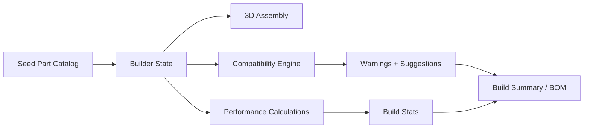

# DroneLab

[](https://github.com/dhruvtoprani/DroneLab)
[](https://github.com/dhruvtoprani/DroneLab)
[](https://nextjs.org/)
[](https://github.com/dhruvtoprani/DroneLab)

DroneLab is a 3D FPV drone builder that lets users assemble a quadcopter, validate part compatibility, estimate flight performance, and understand total build cost before buying hardware.

It frames drone building as a product and engineering problem: how can a user choose modular hardware parts, see how they fit together, and understand whether the system is safe, performant, and worth building?

**Links:** [Source repository](https://github.com/dhruvtoprani/DroneLab) · [Product requirements](docs/PRD.md) · [Current context](docs/CONTEXT.md) · [Next steps](docs/NEXT_STEPS.md)

## Product Thesis

FPV drones are modular, technical, and easy to mismatch. A builder has to reason across frame size, motor KV, propeller diameter, battery voltage, ESC current rating, flight controller mounting, camera fit, payload weight, cost, and expected flight time.

DroneLab turns that scattered decision process into one visual workflow:

> Build the drone in 3D, catch compatibility problems, and estimate performance before spending money on parts.

## Product Snapshot

| Area | Signal |
| --- | --- |
| Product type | 3D hardware configurator and engineering checker |
| Core question | Will this drone build actually work before I buy the parts? |
| User surface | Three-panel builder with part catalog, 3D assembly, and live stats |
| Engineering layer | Weight, cost, battery, current, thrust, flight-time, and payload calculations |
| PM signal | Turning a complex technical buying/building workflow into an understandable product experience |

## What DroneLab Demonstrates

- Interactive 3D quadcopter assembly using generated geometry
- Curated FPV part catalog across all core build categories
- Compatibility checks for fit, voltage, current, mounting, payload, and budget
- Transparent performance estimates for weight, cost, thrust-to-weight, and flight time
- Beginner-readable warnings and suggested fixes
- Local build saving, copyable bill of materials, and CSV export
- Product thinking around modular hardware, simulation, and decision support

## Current Feature Set

| Feature | Status | Purpose |
| --- | --- | --- |
| Landing page | Implemented MVP | Explain the product and route users into the builder |
| Three-panel builder | Implemented MVP | Combine catalog, 3D scene, and engineering stats |
| Generated 3D drone assembly | Implemented MVP | Visualize selected parts without relying on external CAD |
| Seed product catalog | Implemented MVP | Cover frame, motors, props, battery, ESC, FC, camera, receiver, VTX, antenna, and payload |
| Compatibility engine | Implemented MVP | Catch unsafe or invalid part combinations |
| Performance estimates | Implemented MVP | Estimate cost, weight, flight time, current, thrust, and payload reserve |
| BOM copy and CSV export | Implemented MVP | Let users carry the build into a shopping/planning workflow |
| Local build save | Implemented MVP | Preserve one working build without backend dependency |
| Database persistence | Planned | Save, share, and reopen public builds |
| Recommendation engine | Planned | Generate best builds from user goal and budget |
| Real GLB/CAD model pipeline | Planned | Upgrade selected generated parts into realistic assets |

## Tech Stack

- **Frontend:** Next.js 16, React 19, TypeScript
- **3D:** React Three Fiber, Drei, Three.js
- **State:** Zustand
- **Validation:** Zod
- **Styling:** Tailwind CSS, shadcn-style components
- **Data:** Curated JSON seed catalog
- **Engineering Engine:** Pure TypeScript calculation and compatibility modules

## User Journey

1. A user opens the builder and selects a mission profile such as beginner, freestyle, racing, cinematic, long-range, or payload.
2. The user picks parts from the catalog.
3. DroneLab assembles the selected drone in 3D.
4. The stats panel updates weight, cost, flight time, thrust-to-weight ratio, current draw, and payload reserve.
5. Compatibility warnings explain what is wrong and suggest fixes.
6. The user exports a bill of materials or saves the build locally.

## System Concept



The MVP intentionally uses generated geometry and curated seed data before adding live product sources, external pricing, or real manufacturer CAD files.

## Project Structure

```text
DroneLab/
├── src/
│   ├── app/                  # Pages and API routes
│   ├── components/builder/   # Catalog, stats, and builder workspace
│   ├── components/three/     # Generated 3D drone assembly
│   ├── components/ui/        # Reusable UI primitives
│   ├── lib/
│   │   ├── compatibility/    # Calculations, checks, scoring, and suggestions
│   │   ├── data/             # Catalog access helpers
│   │   └── types/            # Product and build contracts
│   └── store/                # Zustand builder state
├── data/seed/                # Curated starter product catalog
├── docs/                     # PRD, context, dev log, and next steps
└── public/models/            # Future GLB asset pipeline
```

## Local Development

```bash
npm install
npm run dev
```

Open:

```text
http://localhost:3000
```

The builder is available at:

```text
http://localhost:3000/builder
```

## Validation

```bash
npm run lint
npm run build
```

## Future Work

- Add unit tests for calculations and compatibility rules
- Add full build JSON export
- Add WebGL unsupported-device fallback
- Add Supabase or Prisma-backed persistence
- Add saved build detail pages and public sharing
- Build curated explore and product detail pages
- Add recommendation search across valid seed combinations
- Add center-of-mass and battery-position controls
- Add build comparison and Pareto tradeoff views
- Calibrate estimates with real thrust tests and flight logs
- Replace selected generated parts with optimized GLB assets where useful

## Portfolio Positioning

DroneLab shows the ability to turn a complex engineering workflow into a polished product surface. It combines product strategy, 3D web development, hardware systems thinking, typed data modeling, compatibility logic, and simulation-style estimation into one focused portfolio project.

## Status

Early MVP / portfolio project. The core local builder, generated 3D assembly, seed catalog, compatibility checks, and performance estimates are implemented. Future work focuses on tests, persistence, public build sharing, recommendation search, real product data, and stronger engineering optimization.

## Disclaimer

DroneLab estimates are approximate and intended for planning and education. Always verify manufacturer specifications, wiring requirements, firmware setup, safety guidelines, and local regulations before purchasing or flying a drone.
